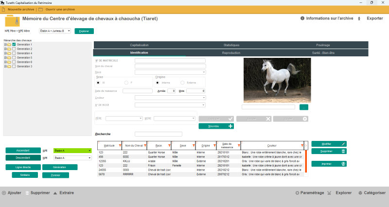
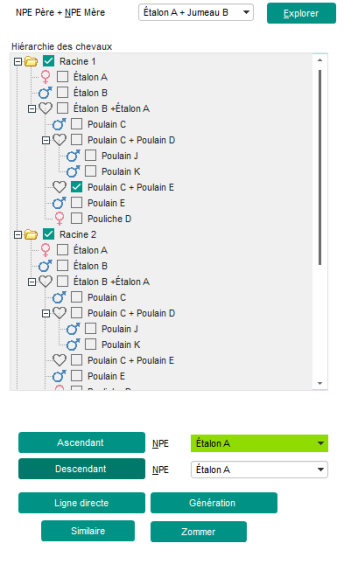
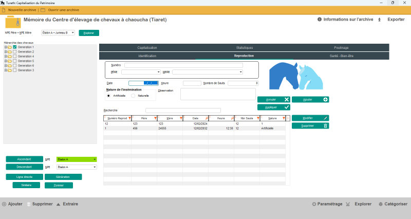
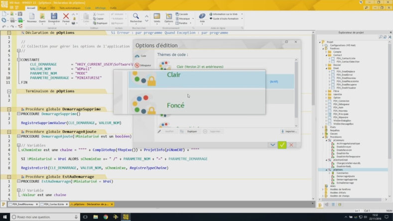
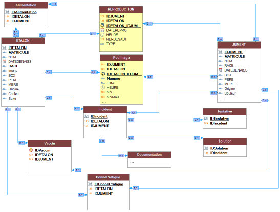
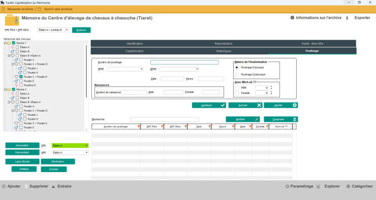
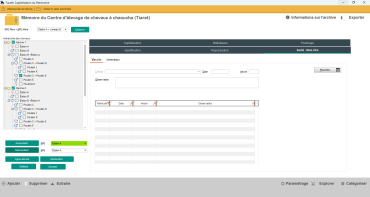
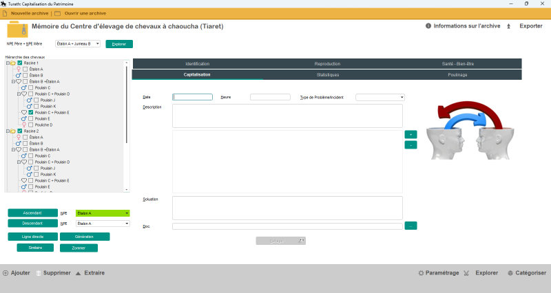
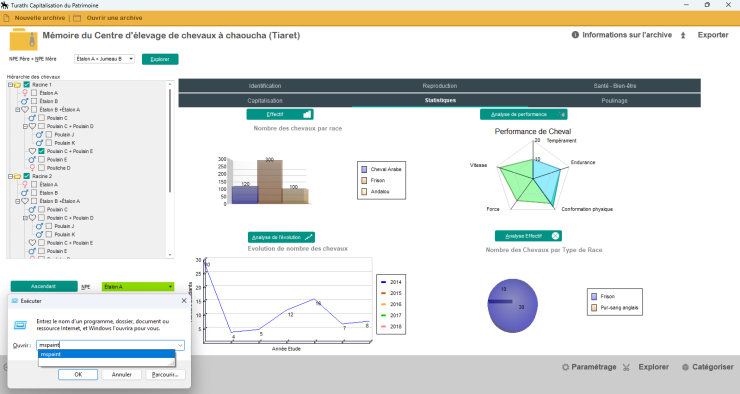
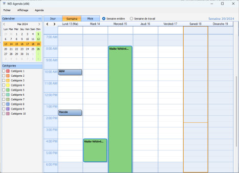

# 🐎 Equestrian Farm Management System

A modern desktop management system developed with WinDev for managing an equestrian farm.

## 📌 Overview

This application helps equestrian farms manage horses, owners, employees, breeding operations, veterinary records, and daily activities through a user-friendly interface.

## ✨ Features

- Secure Login
- Dashboard
- Horse Management
- Owner Management
- Employee Management
- Veterinary Records
- Breeding Management
- Reports & Statistics
- User Administration

## 🛠 Technologies

- WinDev
- HFSQL Database
- WLanguage

## 📸 Screenshots

### Login



### Dashboard



### Horses



### Horse Details



### Owners



### Employees



### Breeding



### Medical Records



### Reports



### Settings



## 📂 Project Structure

```
Project
│
├── Analysis
├── Source Code
├── Database
├── Images
└── Documentation
```

## 👨‍💻 Author

**Ouared Salah Eddine**

Master's Student in Software Engineering

Interested in:
- Artificial Intelligence
- Machine Learning
- Medical AI
- Software Engineering
- LLM
